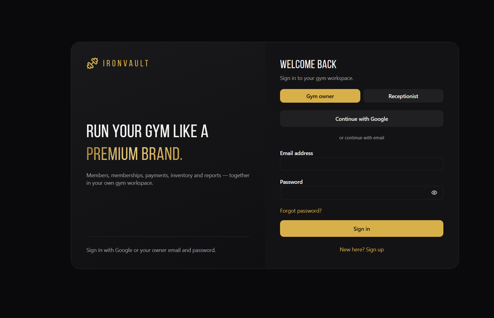

# Owner onboarding and the CEO Hub

Other guide: [Brand the account-confirmation email](./email-branding.md).

The app's `/ceo` page is a separate, platform-owner-only console. It includes customer Pro controls, signup invitations and per-gym workspace JSON exports. For details about Pro grants and single-use codes, see [Manage customer Pro access](./pro-access-management.md).

This walkthrough shows how to restrict **new gym-owner accounts** to email addresses approved from `/ceo`. The app's sign-up screen supports both email/password and Google; the Supabase **Before User Created** hook checks the email on the server before either provider can create a new account.

## Important: current app behavior

The Auth hook is not enabled just because the application has a sign-up screen or the SQL migration is present. Until you apply the pending migration and enable the hook below, public sign-up may still work. The hook blocks new account creation only; revoking an invitation does not disable an account that already exists or invalidate its active session.

This hook blocks **new account creation** only. It does not revoke access from an account that already exists or from an already-issued session. To control existing accounts too, the app's database authorization needs an additional allowlist check; do not assume removing an email from this list immediately signs out or blocks an existing account.

## One-time setup

1. Apply pending database migrations, including `20261004160000_platform_pro_admin.sql` and `20261004170000_ceo_hub.sql`, using the repository's Supabase migration workflow. Do not paste the migration into a live SQL editor if its earlier dependencies are not applied.
2. Create/confirm your own owner login in the app, then open Supabase **SQL Editor → New query**. Open `supabase/queries/bootstrap-platform-admin.sql`, replace `YOUR-ADMIN-EMAIL@example.com` with your own confirmed sign-in email and run it. The query must return your auth user ID; this is the one-time platform-admin bootstrap.
3. In Supabase, open **Authentication → Hooks** (sometimes listed as **Auth Hooks**), enable **Before User Created**, choose the Postgres function `public.iv_before_user_created`, and save.
4. Sign in to the app with the bootstrapped account and open `/ceo`. Add each customer owner's email in **Approve new gym owners** before they try Google or email sign-up.
5. Test with a disposable, unapproved address; Supabase should reject its account creation. Then test an approved address. Do not use a real customer account for the first test.

The supplied login screenshot is included as a guide to the app screen; the Supabase dashboard itself was not captured because Chrome's browser-control helper was unavailable during this task.

The email must match the Google account email or email address used to sign up. An invitation is single-use and applies to one account. The CEO Hub shows pending, used, and revoked invitations. Removing a pending invitation blocks that future account creation; it does not disable an existing account.

## What users see

An unapproved person can still load the public login page, but Supabase rejects the attempt to create a new account. They cannot get a gym workspace just by editing the browser or calling the sign-up API directly, because the check runs inside Supabase Auth before the user record is created.

## Security notes

- The allowlist table has RLS enabled and no direct browser-role permissions. Only the Auth hook can call the decision function; only platform-admin-guarded RPCs can manage/list invitations.
- Every CEO control checks `platform_admins` in Postgres; direct RPC calls by a normal account are denied. Hiding `/ceo` in navigation is not the security control.
- CEO Hub workspace backups include the workspace JSON only. Referenced private storage files (for example, uploaded photos) are not included in that download.
- Do not add a service-role key to the frontend or paste credentials/OTP codes into SQL Editor.
- Existing users are not automatically migrated into the allowlist. They can continue signing in unless a separate access-control change revokes them.

## Reference

Supabase's official [Before User Created hook guide](https://supabase.com/docs/guides/auth/auth-hooks/before-user-created-hook) documents the hook and SQL-function setup.
